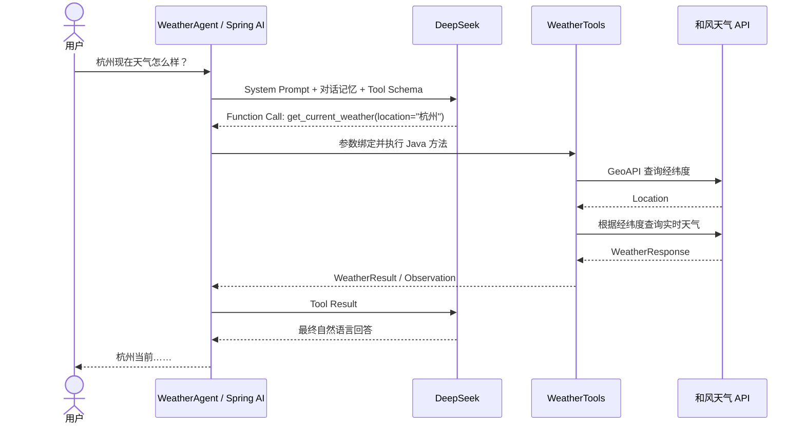

# Spring AI Weather Agent

基于 Java 21、Spring Boot、Spring AI、DeepSeek 和和风天气 API 实现的实时天气 Agent。

这个项目不是简单地把天气接口包装成 HTTP 服务。它通过 Spring AI 的
**Function Calling / Tool Calling** 机制，将大模型、会话记忆和
`get_current_weather` 工具组合起来，形成 ReAct-style 的工具调用循环：模型负责判断是否需要
实时数据，Spring AI 负责执行工具并回传 Observation，模型再根据真实天气生成最终回答。

## 主要能力

- 使用自然语言查询城市、区县或地点的实时天气。
- 通过 Tool Schema 向大模型暴露 `get_current_weather` 工具。
- 使用和风天气 GeoAPI 将地点名称解析为经纬度，再查询实时天气。
- 返回天气现象、温度、体感温度、湿度、风向、风力等级和查询时间。
- 使用 `sessionId` 隔离对话，并保留每个会话最近 20 条消息。
- 对网络异常和服务端 5xx 进行有限重试，并通过熔断器防止故障扩散。
- 将外部服务异常转换成结构化 Tool Result，要求模型如实说明失败，避免编造实时天气。

## Function Calling 流程



Spring AI 会持续执行“模型推理 → Function Call → 工具执行 → Observation → 模型再次推理”，
直到模型返回不包含工具调用的最终文本。业务代码不需要手写循环。

## 工具定义

项目向模型注册一个实时天气工具：

```java
@Tool(
    name = "get_current_weather",
    description = "查询指定城市的实时天气，包括天气现象、温度、体感温度、湿度和风力"
)
public WeatherResult getCurrentWeather(
        @ToolParam(description = "城市、区县或地点名称") String location) {
    return weatherService.getCurrentWeather(location);
}
```

`WeatherResult` 是结构化返回值：

- 成功时包含地点、天气现象、温度、体感温度、湿度、风向、风力等级和时间。
- 失败时包含 `success=false`、`errorCode` 和 `errorMessage`。

## 技术栈

| 组件 | 用途 |
| --- | --- |
| Java 21 | 运行时与语言版本 |
| Spring Boot 3.5.13 | Web 应用与自动配置 |
| Spring AI 1.1.8 | ChatClient、Memory 和 Tool Calling |
| DeepSeek `deepseek-chat` | 工具选择与自然语言生成 |
| Spring MVC `RestClient` | 调用和风天气 API |
| Resilience4j 2.3.0 | Retry 与 Circuit Breaker |
| 和风天气 GeoAPI / Current Weather API | 地点解析与实时天气数据 |

## 项目结构

```text
src/main/java/com/example/weatheragent
├── WeatherAgentApplication.java        Spring Boot 启动类
├── agent/WeatherAgent.java             Agent 入口与会话上下文
├── config/AgentConfiguration.java      Prompt、Memory、Tool 注册
├── config/HttpClientConfiguration.java HTTP 客户端与超时配置
├── config/QWeatherProperties.java      和风天气配置映射
├── domain/WeatherResult.java           结构化 Tool Result
├── qweather/QWeatherApiClient.java     和风天气 API 客户端
├── qweather/QWeatherDtos.java          外部 API DTO
├── service/WeatherService.java         天气查询编排与降级
├── tool/WeatherTools.java              模型可调用的天气工具
└── web/WeatherAgentController.java     HTTP 接口
```

## 环境要求

- JDK 21
- Maven 3.6+
- DeepSeek API Key
- 和风天气专属 API Host 与 API Key

启动前确认 Maven 使用的是 JDK 21：

```bash
java -version
mvn -version
```

如果系统安装了多个 JDK，请确保 `JAVA_HOME` 指向 JDK 21。

## 配置

请先在和风天气控制台创建项目，获取专属 API Host 和 API Key。API Host 应使用控制台提供的
`*.qweatherapi.com` 域名。

推荐通过环境变量提供凭据：

```bash
export DEEPSEEK_API_KEY="your-deepseek-api-key"
export DEEPSEEK_BASE_URL="https://api.deepseek.com"
export DEEPSEEK_MODEL="deepseek-chat"

export QWEATHER_API_HOST="https://your-host.qweatherapi.com"
export QWEATHER_API_KEY="your-qweather-api-key"
```

也可以在项目根目录创建 `application-local.yml`：

```yaml
spring:
  ai:
    deepseek:
      api-key: your-deepseek-api-key

qweather:
  api-host: https://your-host.qweatherapi.com
  api-key: your-qweather-api-key
```

`application-local.yml` 已被 `.gitignore` 忽略，且不会被打包进 Jar。不要把真实密钥写入
`src/main/resources/application.yml` 或提交到版本库。

## 启动项目

```bash
mvn spring-boot:run
```

服务默认监听 `http://localhost:8080`。启动成功后可以查看健康状态：

```bash
curl http://localhost:8080/actuator/health
```

## 调用接口

接口：

```http
GET /api/agent/chat?sessionId={sessionId}&message={message}
```

示例：

```bash
curl --get http://localhost:8080/api/agent/chat \
  --data-urlencode 'sessionId=demo-user' \
  --data-urlencode 'message=杭州现在天气怎么样，需要带伞吗？'
```

响应示例：

```json
{
  "sessionId": "demo-user",
  "answer": "杭州当前晴间多云，气温约 26℃……"
}
```

`sessionId` 用于隔离对话上下文。同一会话可以继续追问，例如“那体感温度呢？”；不同
`sessionId` 之间不会共享消息记录。

## 容错策略

| 场景 | 处理方式 |
| --- | --- |
| 连接或响应过慢 | 连接超时 2 秒，读取超时 3 秒 |
| 网络异常、超时、服务端 5xx | 最多尝试 2 次，并使用指数退避 |
| 参数错误、鉴权失败、其他 4xx | 不重试，返回明确错误码 |
| 连续临时故障 | 达到阈值后熔断 30 秒 |
| 熔断器打开 | 返回 `QWEATHER_CIRCUIT_OPEN` |
| 未配置和风天气凭据 | 返回 `QWEATHER_NOT_CONFIGURED`，应用仍可启动 |
| 未预期异常 | 返回 `WEATHER_TOOL_ERROR`，同时记录服务端日志 |

工具失败时会返回结构化的 `WeatherResult`。System Prompt 明确要求模型根据错误信息说明原因，
不得编造天气。GeoAPI 查询结果不做落地缓存，以遵守和风天气关于地理信息数据缓存的许可要求。

## 测试

```bash
mvn test
```

当前测试覆盖：

- Spring 容器与 Agent/Tool 配置加载；
- HTTP 参数校验和接口响应；
- Tool 注解与服务调用；
- 天气响应到 `WeatherResult` 的映射；
- 未配置凭据和上游错误的结构化降级；
- 和风天气安全限制错误码解析。

## 生产环境建议

当前项目适合作为 Spring AI Function Calling 的完整示例。部署到生产环境前，建议进一步加入：

- 身份认证、用户级会话隔离、限流和配额控制；
- Redis 或数据库会话存储及 TTL；
- 模型调用的总超时、并发隔离和熔断；
- 链路追踪、调用耗时、失败率和 Token 消耗监控；
- 独立且受保护的 Actuator 管理端口。
